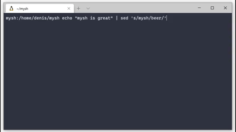

# mysh

A light shell for FreeBSD systems and OS X. 

## Functionality

The shell is compatible with FreeBSD, but it also runs on Ubuntu, Debian, and OS X.

It supports built in commands such as `cd`, pipes, and redirections.

## Instructions

Prerequisites include `readline.h`, flex, and bison.

On non-tested distributions, mysh is not guaranteed to run correctly. For example, Solaris requires minor changes to the code.

